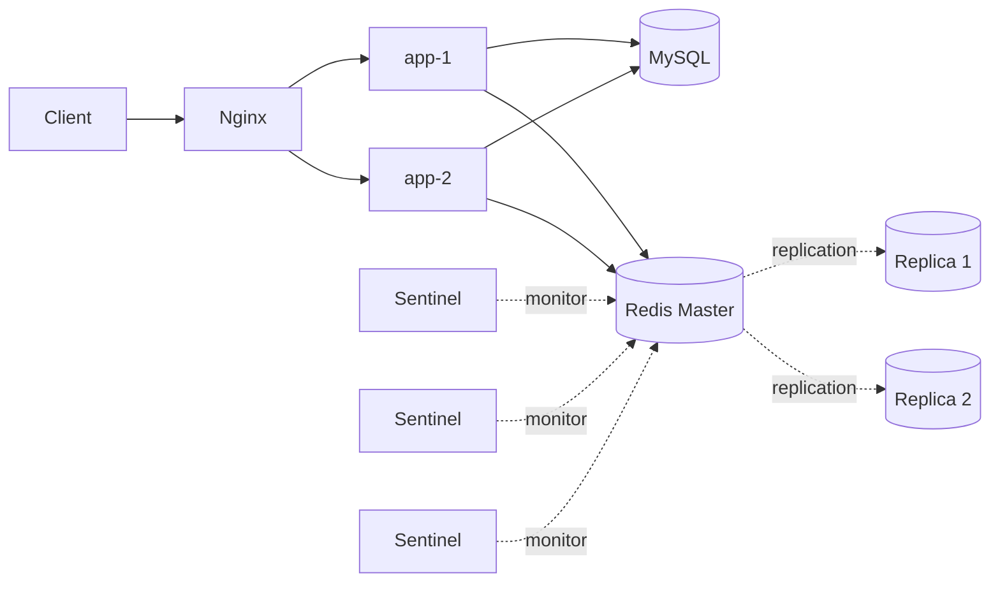
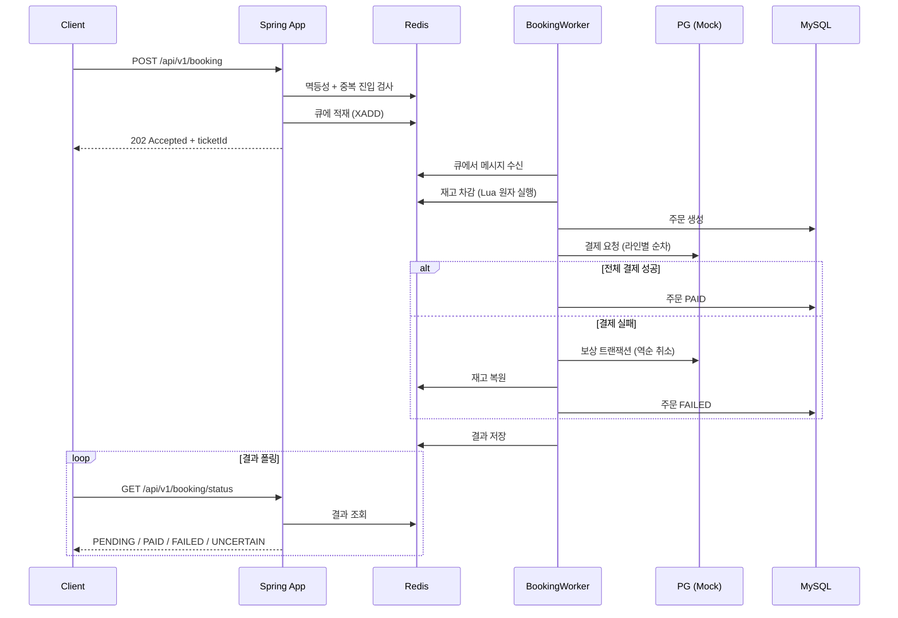
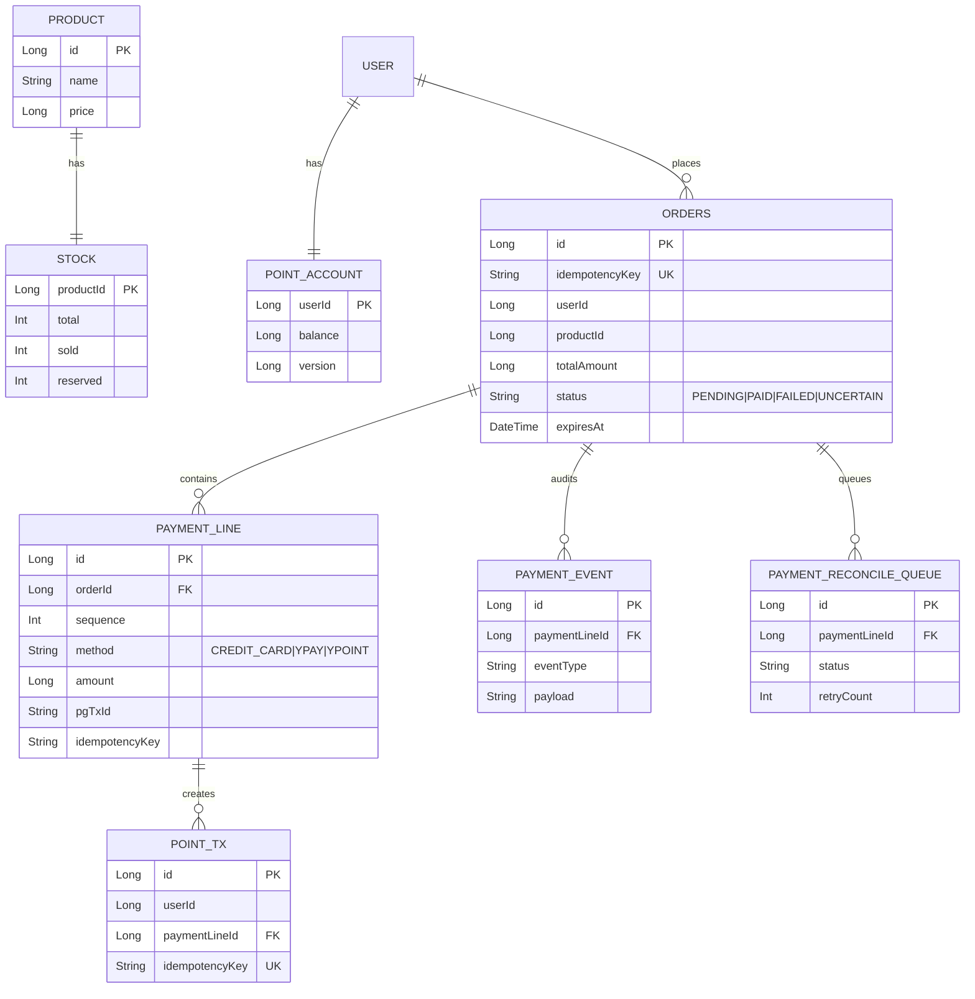

# Flashsale - 선착순 예약 시스템

00시에 오픈되는 초특가 숙소 상품(10개 한정)에 대한 선착순 예약 시스템입니다. 2대 이상의 애플리케이션 서버 분산 환경에서 재고 정합성, 멱등성, 장애 대응을 보장합니다.

## 기술 스택

| 항목 | 선택              |
|---|-----------------|
| Language | Java 17         |
| Framework | Spring Boot 3.5 |
| DB | MySQL 8.0       |
| Cache / Queue | Redis 7.2       |
| Load Balancer | Nginx           |
| Migration | Flyway          |
| Test | JUnit 5         |
| Container | Docker Compose  |

## 실행 방법

### 사전 요구사항

Docker와 Docker Compose가 설치되어 있어야 합니다.

### 전체 스택 기동

```bash
docker compose up --build -d
```

- **기동되는 서비스:**
  - `nginx` (포트 8080) — 로드 밸런서
  - `app-1`, `app-2` — Spring Boot 인스턴스 2대
  - `mysql` (포트 3306)
  - `redis-master`, `redis-replica-1`, `redis-replica-2` — Redis Master 1대 + Replica 2대
  - `sentinel-1`, `sentinel-2`, `sentinel-3` — Sentinel 3대

### 기동 확인

```bash
docker compose logs -f app-1 | grep -m 1 "Started"
```

### 테스트 실행

```bash
./gradlew test
```

---

## 시스템 구조

### 컴포넌트



### 예약 처리 흐름



### 디렉터리 구조

```
src/main/java/com/flashsale/
├── domain/                   # 도메인 모델 (POJO)
├── application/              # 유스케이스 + 포트 인터페이스
├── infrastructure/           # JPA, Redis, PG 어댑터
└── interfaces/               # Controller, DTO, 예외 핸들러

src/main/resources/
├── db/migration/             # Flyway
└── lua/                      # atomic_reserve.lua, atomic_restore.lua

infra/                        # Docker, Nginx, Sentinel 설정
```

---

## 데이터 모델



전체 DDL은 `src/main/resources/db/migration/V1__init.sql`에서 확인할 수 있습니다.

---

## API 목록

| Method | Path | 설명 |
|---|---|---|
| GET | `/api/v1/checkout` | 주문서 조회 (상품 + 잔여 재고 + 가용 포인트) |
| POST | `/api/v1/booking` | 예약 요청 (비동기, 202 반환) |
| GET | `/api/v1/booking/status` | 예약 결과 조회 (폴링) |

공통 응답 형식은 다음과 같습니다.

```json
{
  "code": "SUCCESS",
  "message": null,
  "data": { ... }
}
```

---

### GET /api/v1/checkout

**요청**

```http
GET /api/v1/checkout?productId=1
X-User-Id: 1
```

**응답 (200)**

```json
{
  "code": "SUCCESS",
  "data": {
    "product": {
      "id": 1,
      "name": "강남 시그니엘 디럭스 1박",
      "price": 50000,
      "saleStartAt": "2026-05-14T00:00:00",
      "saleEndAt": "2026-05-14T23:59:59",
      "checkInAt": "2026-06-01T15:00:00"
    },
    "stock": { "remaining": 7 },
    "userPoint": { "balance": 100000 }
  }
}
```

**실패 응답**

- `400 MISSING_HEADER`: X-User-Id 누락
- `400 MISSING_PARAMETER`: productId 누락
- `404 PRODUCT_NOT_FOUND`: 상품 없음

---

### POST /api/v1/booking

**요청**

```http
POST /api/v1/booking
X-User-Id: 1
Idempotency-Key: idem-uuid-1234
Content-Type: application/json

{
  "productId": 1,
  "totalAmount": 50000,
  "paymentLines": [
    { "sequence": 1, "method": "YPOINT", "amount": 30000, "idempotencyKey": "pay-1-point" },
    { "sequence": 2, "method": "CREDIT_CARD", "amount": 20000, "cardNumber": "1234-5678-9012-3456", "idempotencyKey": "pay-1-card" }
  ]
}
```

**응답 (202)**

```json
{
  "code": "SUCCESS",
  "data": {
    "ticketId": "1715641200000-0",
    "queuePosition": 3
  }
}
```

**실패 응답**

- `400 MISSING_HEADER`: X-User-Id 또는 Idempotency-Key 누락
- `400 INVALID_REQUEST_BODY`: 요청 본문이 잘못된 JSON
- `400 INVALID_PAYMENT_COMPOSITION`: 신용카드와 Y페이 혼용
- `409 DUPLICATE_BOOKING`: 동일 사용자의 진행 중 예약 존재
- `415 UNSUPPORTED_MEDIA_TYPE`: Content-Type이 JSON이 아님
- `503 SERVICE_UNAVAILABLE`: Kill Switch 활성화 (`Retry-After: 5` 헤더 포함)

---

### GET /api/v1/booking/status

**요청**

```http
GET /api/v1/booking/status?productId=1&ticketId=1715641200000-0
X-User-Id: 1
```

**응답 (200) — 상태별 예시**

처리 중:
```json
{ "code": "SUCCESS", "data": { "status": "PENDING" } }
```

결제 완료:
```json
{
  "code": "SUCCESS",
  "data": { "status": "PAID", "orderId": 1234 }
}
```

결제 실패:
```json
{
  "code": "SUCCESS",
  "data": { "status": "FAILED", "code": "SOLD_OUT", "message": "재고가 소진되었습니다" }
}
```

결제 불확실 (PG 응답 대기):
```json
{
  "code": "SUCCESS",
  "data": { "status": "UNCERTAIN", "message": "결제 확인 중입니다" }
}
```

---

## AI 활용 범위

**사용 도구**: Claude.ai (Skill: superpower)

**설계 단계**

- 클린 아키텍처에서 도메인과 인프라 간 의존성 방향 검토 
- 복합 결제 보상 트랜잭션의 분기 시나리오를 PG 응답 타입(Success / Failure / Unknown)별로 분류하고, 보상 실패 시 추가 처리 방향 검토
- 분산 환경에서 워커 재시작과 메시지 재처리 시 발생할 수 있는 경합 시나리오 식별

**구현 단계**

- Redis Lua 스크립트의 원자성 보장 범위와 `ticket_processed` SET을 활용한 워커 재처리 멱등성 검증
- BookingWorker 분기별 테스트 케이스 도출 (Kill Switch, 재배달 한도, 기존 주문, 결제 성공/실패/불확실 등 8개 그룹)

**검증 단계**

- 통합 테스트 간 상태 격리 패턴 설계 (`@BeforeEach` + Redis FLUSHDB + DB TRUNCATE + 시드 데이터 재설정)
